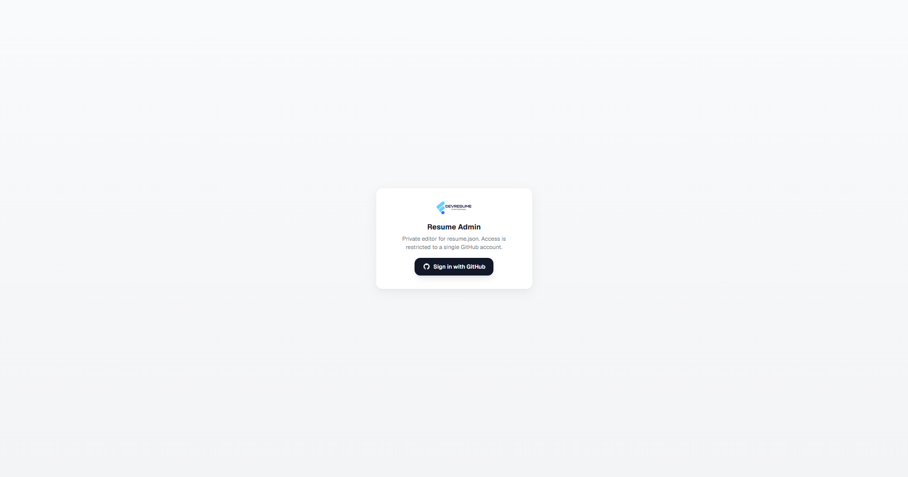
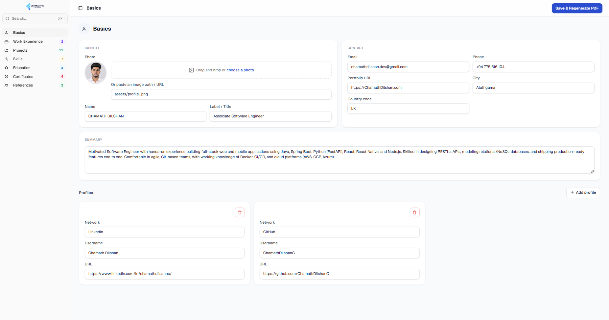
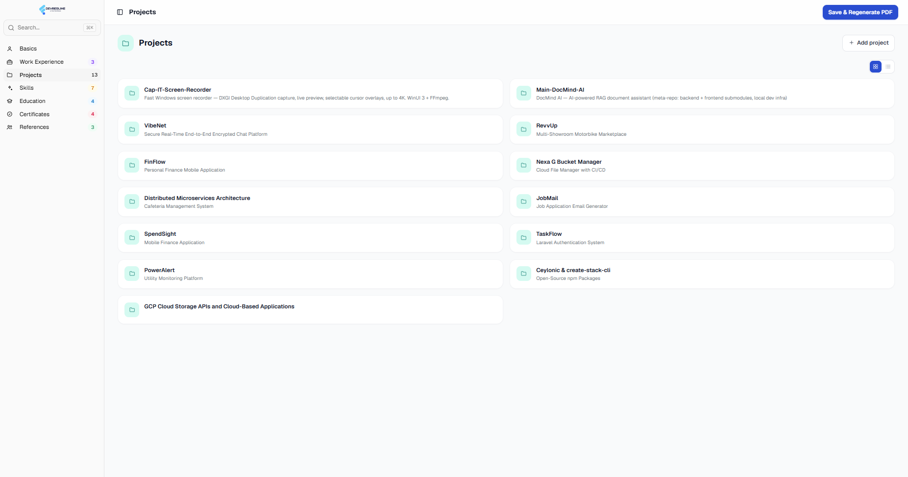
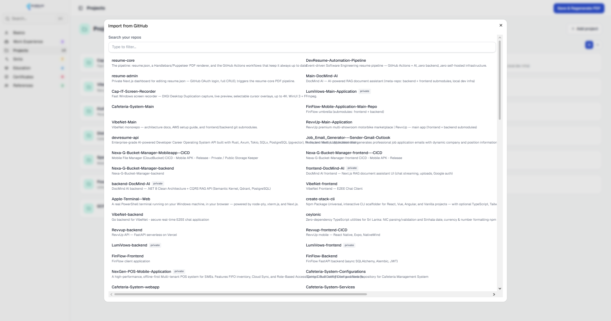
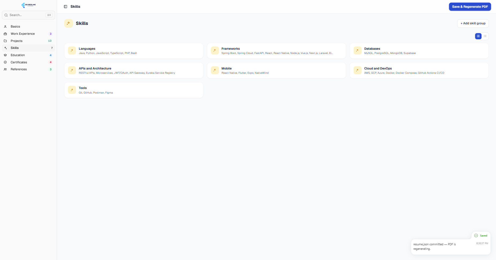
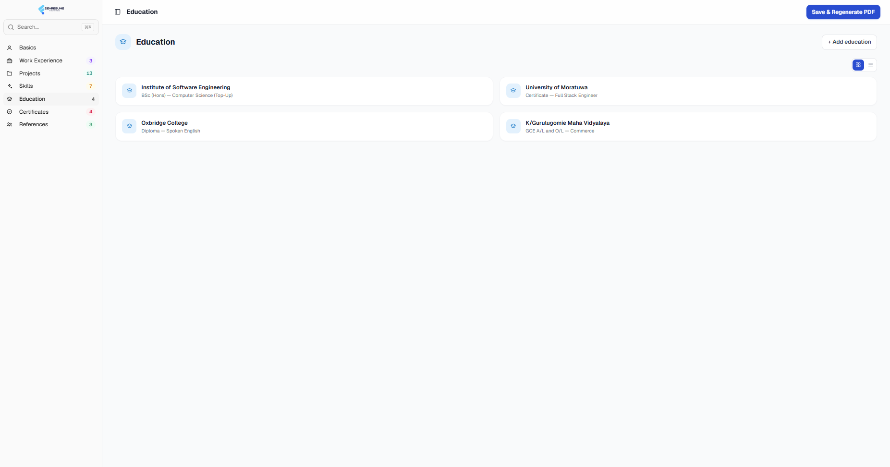
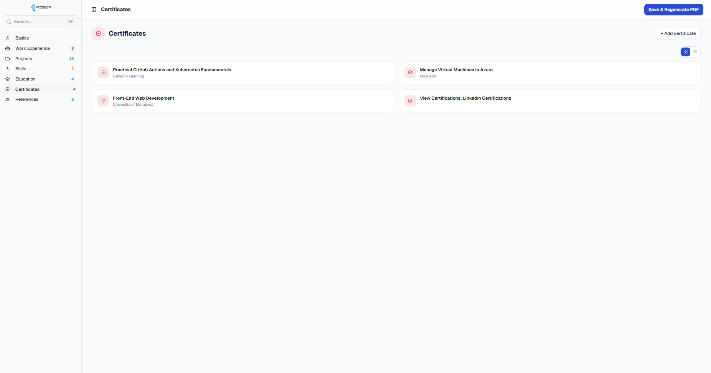
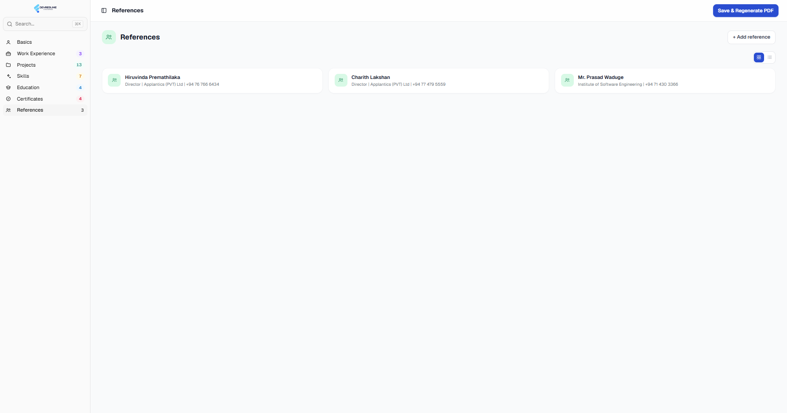
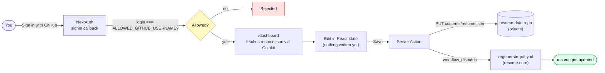

<div align="center">


### A private, single-login dashboard for editing `resume.json` — no git commands required.


</div>

---

A private, single-user editor for `resume.json`, which lives in the private
[resume-data](https://github.com/ChamathDilshanC/resume-data) repo (kept out
of the public [resume-core](https://github.com/ChamathDilshanC/resume-core)
pipeline repo since it holds contact details and reference phone numbers).
Sign in with GitHub (locked to a single account), edit any section of the
resume in a full-width card dashboard, and save — it commits `resume.json`
straight to `resume-data` and triggers the existing Puppeteer pipeline in
`resume-core` to regenerate `resume.pdf`.

No database, no separate backend: reads/writes go directly through the GitHub
API using your own OAuth session, and PDF rendering reuses the
`generate-pdf.js` script and `regenerate-pdf.yml` workflow already in
`resume-core`.

## Interface

- **Sidebar navigation** (shadcn `sidebar-01` block) with a live command
  palette (`⌘K`) search, per-section item counts, and the signed-in GitHub
  account in the footer
- **Responsive card grid** for every section — Work Experience and Projects
  as 2-column cards, Skills/Education/Certificates/References up to 3 columns
  — instead of one long stacked form
- **Drag-and-drop photo upload** straight to `resume-core/assets/`, with a
  live preview proxied through a private, authenticated API route
- **Toast notifications** ([`goey-toast`](https://goey-toast.vercel.app)) on
  save success/failure

## Screenshots

<table>
<tr>
<td width="50%"><br/><sub><b>Sign in</b> — single-account GitHub OAuth gate</sub></td>
<td width="50%"><br/><sub><b>Basics</b> — Identity / Contact / Summary cards</sub></td>
</tr>
<tr>
<td width="50%"><br/><sub><b>Work Experience</b> — card grid with grid/list toggle</sub></td>
<td width="50%"><br/><sub><b>Projects</b> — 13 tracked projects, click any card for full detail</sub></td>
</tr>
<tr>
<td width="50%"><br/><sub><b>Add project → Import from GitHub</b> — pick a repo, AI drafts the bullets</sub></td>
<td width="50%"><br/><sub><b>Skills</b> — grouped skill cards</sub></td>
</tr>
<tr>
<td width="50%"><br/><sub><b>Education</b></sub></td>
<td width="50%"><br/><sub><b>Certificates</b></sub></td>
</tr>
<tr>
<td width="50%"><br/><sub><b>References</b></sub></td>
<td width="50%"></td>
</tr>
</table>

## How it works



1. Sign in with GitHub. The `signIn` callback in `lib/auth.ts` only allows the
   account named in `ALLOWED_GITHUB_USERNAME` — everyone else is rejected.
2. The GitHub OAuth token (requested with `repo` + `workflow` scope) is kept
   in the encrypted session and used server-side (never sent to the browser)
   to call the GitHub REST API via Octokit.
3. `/dashboard` fetches `resume.json` from `resume-data` on page load.
4. Editing happens entirely client-side in React state — nothing is written
   until you click **Save**.
5. **Save** runs a Server Action (`app/dashboard/actions.ts`) that commits the
   updated JSON to `resume-data` via `PUT /repos/{owner}/resume-data/contents/resume.json`,
   then dispatches `resume-core`'s `regenerate-pdf.yml` workflow so
   `resume.pdf` updates too.

## One-time setup

### 1. Create a GitHub OAuth App

GitHub OAuth Apps can only be created through the browser (not the API), so
this step can't be automated:

1. Go to <https://github.com/settings/developers> → **OAuth Apps** → **New OAuth App**
2. **Application name:** `Resume Admin` (anything you like)
3. **Homepage URL:** your deployed URL (e.g. `https://resume-admin.vercel.app`) — use `http://localhost:3000` while testing locally
4. **Authorization callback URL:** `<homepage URL>/api/auth/callback/github`
5. Create the app, then **Generate a new client secret**
6. Copy the **Client ID** and **Client Secret** — you'll need both below

### 2. Environment variables

Copy `.env.example` to `.env.local` (for local dev) and fill in:

- `GITHUB_OAUTH_CLIENT_ID` / `GITHUB_OAUTH_CLIENT_SECRET` — from step 1
- `NEXTAUTH_SECRET` — generate with `openssl rand -base64 32`
- `NEXTAUTH_URL` — `http://localhost:3000` locally, your real deployed URL in production
- `ALLOWED_GITHUB_USERNAME` — defaults to `ChamathDilshanC`
- `RESUME_REPO_OWNER` / `RESUME_REPO_NAME` — the pipeline repo, defaults to
  `ChamathDilshanC/resume-core`
- `RESUME_DATA_REPO_NAME` — the private repo `resume.json` itself lives in,
  defaults to `resume-data`
- `GDRIVE_CREDENTIALS` *(optional — only needed for the "Project Drive"
  page)* — the same Google Cloud service-account JSON key used as
  resume-core's `GDRIVE_CREDENTIALS` secret. Copy the exact same value; this
  app only ever reads (read-only Drive scope) — folder/file creation stays
  resume-core's job.

### 3. Run locally

```bash
npm install
npm run dev
```

Visit `http://localhost:3000`, sign in with GitHub, and you should land on
the dashboard.

### 4. Deploy to Vercel

```bash
vercel
```

Or connect the GitHub repo in the Vercel dashboard. Either way, set the same
environment variables from step 2 in the Vercel project settings (with
`NEXTAUTH_URL` and the OAuth App's callback URL updated to the real domain).

## Security notes

- Only one GitHub account can sign in — everyone else's login attempt is
  rejected in the NextAuth `signIn` callback.
- No separate write-access secret is stored on the server: the signed-in
  user's own OAuth token (with `repo` scope) is what performs the commit, so
  changes are always attributable to that account. That same token is what
  gives access to the private `resume-data` repo — no extra secret needed
  since the signed-in account owns it.
- The OAuth token lives only in the encrypted, httpOnly session cookie — it
  is never exposed to client-side JavaScript.
- `/api/asset` proxies private repo images (like the profile photo) through
  an authenticated server route so `` tags never need a public URL or a
  client-exposed token.
